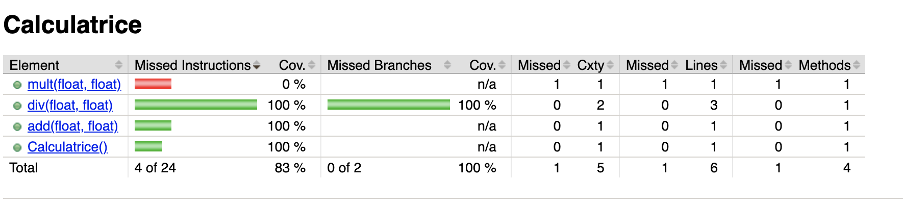

# test

## JUnit

Soit la classe Calculatrice à tester :
https://github.com/charroux/test/blob/master/src/main/java/com/example/test/Calculatrice.java

Exemple d'un programme de test JUnit: 
https://github.com/charroux/test/blob/master/src/test/java/com/example/test/TestApplicationTests.java

## Mock

Soit la classe Statistique à tester : https://github.com/charroux/test/blob/master/src/main/java/com/example/test/Statistique.java

Cette classe utilise la classe Calculatrice de la question précédente.

Exemple de programe de test qui utilise un mock de la classe Calculatrire pour tester la classe Statistique :
https://github.com/charroux/test/blob/master/src/test/java/com/example/test/TestApplicationTests.java

## Tests de couverture de code

En exécutant un programme de couverture de code comme Jacoco on obtient le rapport de tests suivant : 

Comment interpréter ce résultat ?
Que faut-il faire pour améliorer ce résultat ?

Réponse : il faut ajouter des tests pour garantir une couverture totale du code.